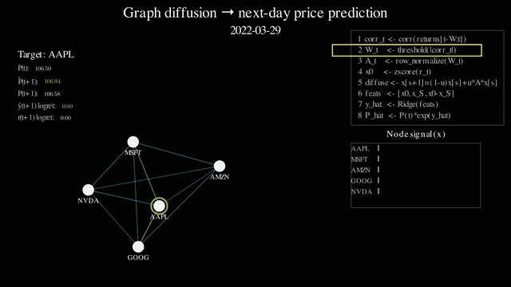

# Graph Diffusion Price Predictor (Manim + Streamlit)

This mini-project focuses on **one idea**: treat a universe of stocks as a **graph**, diffuse a **cross‑sectional signal** over that graph (message passing), then use the diffused signal to predict **next‑day log returns** (and therefore next‑day prices).

It is meant for **visualization + intuition**, not for investment advice or a production trading system.

### Demo



[Watch full video (1080p)](https://github.com/tatsunori-ono/graph-diffusion-price-predictor/releases/download/v1.0/GraphDiffusionPricePredictor.mp4)

---

## 1) Setup

Create / activate a venv, then:

```bash
pip install -r requirements.txt
```

If you're only using Manim and already have it installed, you can skip installing Manim from pip.

---

## 2) Export data

This downloads prices (via `yfinance`), builds a rolling correlation graph, runs diffusion steps, and generates walk‑forward Ridge predictions.

```bash
# Using the bundled demo CSV:
python3 export_gd_data.py \
  --start 2022-01-03 --end 2022-06-17 \
  --tickers AAPL MSFT AMZN GOOG NVDA \
  --target AAPL \
  --csv demo_prices.csv \
  --thr 0.05 \
  --out gd_data.npz

# Or download live data via yfinance:
python3 export_gd_data.py \
  --start 2022-01-03 --end 2022-03-04 \
  --tickers AAPL MSFT AMZN GOOG META NVDA TSLA NFLX JPM BAC CSCO INTC AMD ORCL IBM XOM KO PEP DIS BABA \
  --target AAPL \
  --out gd_data.npz
```

Outputs:
- `gd_data.npz`
- `gd_meta.json`

---

## 3) Render Manim animation

```bash
export DATA=gd_data.npz
export MAX_FRAMES=25       # optional
export EDGE_THR=0.25       # optional

manim -pqh animate_graph_diffusion_predictor.py GraphDiffusionPricePredictor
```

Try higher quality:
```bash
manim -p -r 1080,1920 animate_graph_diffusion_predictor.py GraphDiffusionPricePredictor
```

---

## 4) Run the interactive viewer (Streamlit)

```bash
export DATA=gd_data.npz
streamlit run streamlit_app.py
```

This gives you:
- a time slider (date index)
- a diffusion step slider
- a graph view with nodes colored by the diffused signal
- predicted vs actual next‑day price for your chosen target ticker

---

## Notes / knobs that matter

- `--window`: correlation lookback window (bigger = smoother graph, fewer samples)
- `--thr`: edge sparsity (bigger = fewer edges)
- `--mu` and `--steps`: diffusion dynamics (how far the signal propagates)
- `--ridge-alpha`: regularization (bigger = smoother predictions)

---

## Data / modeling disclaimer

This is a **didactic** model:
- uses simple correlation graphs,
- diffuses a cross‑sectional z‑scored return signal,
- fits a Ridge regression in a walk‑forward manner.

It is **not** a validated trading strategy.
