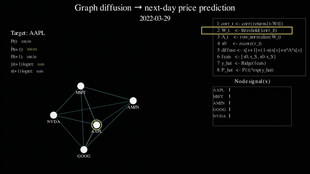

# Graph Diffusion Equity Research



*The animation above is the original visual prototype — a Manim/Streamlit graph-diffusion demo (see
[`demos/visual_prototype/`](demos/visual_prototype/README.md),
[full video](https://github.com/tatsunori-ono/graph-diffusion-price-predictor/releases/download/v1.0/GraphDiffusionPricePredictor.mp4)).
It's what the idea looked like before it became the research framework below — see
[Project Evolution](#1-project-evolution) for how the two connect.*

> **Honest headline: the real-market-data result is negative.** This repository has been run
> end-to-end on live Yahoo Finance data (not a synthetic placeholder — see
> [Section 6, Results](#6-results)). The graph-diffusion signal, as implemented here, does **not**
> show a cost-robust edge over the 2019–2026 test period: net Sharpe for the Ridge strategy is
> **-1.81** against **+0.92** for buy-and-hold SPY, and the permutation test finds no significant
> rank relationship between predictions and forward returns. This is reported as a genuine research
> finding, not reframed as a success — see Section 6 for the full numbers and Section 9 for how to
> talk about a negative result in an interview.

This project tests whether cross-asset information diffusion in equity markets can be captured with
rolling correlation graphs and evaluated honestly through a leakage-safe, walk-forward backtesting
framework. It builds a dynamic correlation graph over a ~29-stock universe (semiconductors/tech,
Japanese media/gaming/IP, and transport/logistics, plus sector benchmarks), engineers graph-diffusion
features (lagged neighbour returns, residual-shock scores, weighted-degree centrality) alongside
standard own-return/volatility/momentum features, and feeds them into interpretable linear models
inside a walk-forward backtest with realistic transaction costs, benchmark comparison, and
statistical robustness checks (permutation tests, bootstrap confidence intervals). Every stage —
graph construction, feature timing, model refitting, portfolio weighting — is built to a strict
no-look-ahead discipline that is directly tested, not just asserted.

## 1. Project Evolution

This repository is one idea that matured through two stages, not two separate projects bolted
together:

1. **[`demos/visual_prototype/`](demos/visual_prototype/README.md)** — the original prototype. A
   Manim animation and a Streamlit app that treat a small stock universe as a graph, diffuse a
   cross-sectional signal across it, and visualise the result. Built for **intuition**: it is how
   the idea was first explored, not a validated result. No walk-forward validation, no transaction
   costs, no statistical testing.
2. **The repository root (`src/`, `tests/`, `config/`, `scripts/`, `reports/`)** — the research
   edition. The same underlying idea (diffusion of information across a correlation graph) rebuilt
   as a rigorous, leakage-safe quant research framework: walk-forward validation with periodic
   refits, realistic transaction costs, benchmark comparison against SPY/QQQ/SMH/IYT, permutation
   and bootstrap significance tests, an explicit failure-case and limitations analysis, and an
   automated PDF report.

Read the visual prototype first if you want the intuition; read everything from Section 4 onward if
you're evaluating this as research/engineering work. The prototype is preserved in full (animations,
demo CSVs, Streamlit viewer) because it's useful context for how the hypothesis was formed — but it
is explicitly secondary to the research framework, which is what should be judged as the project's
output.

## 2. Research Hypothesis

Information shocks affecting one company may propagate to economically or thematically related
companies with a short delay, rather than being priced into all related names simultaneously.
A **rolling correlation graph** — rather than a static sector label — is used to approximate these
changing relationships, since the actual linkages between companies (supply chains, thematic
overlap, investor-flow correlation) drift over time. If such a delay exists and is even weakly
persistent, a stock's **lagged neighbour returns** (as defined by that rolling graph) and its
**residual-shock features** may carry information about its own near-future **residual return** —
i.e. its return after stripping out market and sector beta.

## 3. Why the Signal Might Exist

The hypothesis is motivated by several plausible (but not proven) transmission mechanisms:

* **Supply-chain links** — a shock to a foundry or component supplier can take time to be reflected
  in downstream customers' prices.
* **ETF / index / thematic flows** — capital rotating into a theme (e.g. "AI capex") can pull
  correlated names together with staggered timing as flows and rebalancing propagate.
* **Sector rotation** — broad allocation shifts between sectors can hit constituent names at
  different speeds depending on liquidity and coverage.
* **Delayed investor reaction** — lower-coverage or lower-liquidity names may react to news with a
  lag as fewer participants immediately reprice them.
* **Common factor exposure** — shared exposure to market/sector/style factors that isn't always
  priced in simultaneously across all exposed names.
* **Attention / news diffusion** — news and analyst attention spreading across related names over
  hours to days rather than instantaneously.

None of these are asserted as proven effects here — they are the economic rationale for why the
hypothesis is worth testing rigorously rather than dismissing outright, and the results in this repo
should be read as a genuine test of that hypothesis, not a foregone conclusion.

## 4. Methodology

```
yfinance (or cached CSV / synthetic fallback)
        |
   data.py       --> clean + align trading calendar, drop low-history tickers
        |
   features.py   --> rolling-beta residual returns (t-1 betas only)
        |
   graph.py      --> rolling correlation graph, window ends at t-1, top-k positive edges, row-normalised
        |
   features.py   --> own returns, vol, volume surprise, neighbour diffusion/shock scores,
        |             centrality, sector/market return, momentum/reversal  [all known by close of t]
        |
   backtest.py   --> walk-forward: train on date < boundary, predict [boundary, next boundary)
        |             models: Ridge / ElasticNet (StandardScaler refit per fold) / rank-on-diffusion-score
        |
   portfolio.py  --> rank cross-section, dollar-neutral long/short quantiles, position cap, turnover,
        |             transaction costs applied against realised turnover
        |
   metrics.py / plots.py / report.py --> Sharpe/Sortino/drawdown/alpha/IR, benchmark comparison,
                                          permutation + bootstrap tests, cost sensitivity,
                                          parameter sensitivity, automated PDF report
```

Key methodological components:

* **Data** — adjusted-close OHLCV via `yfinance`, with a deterministic cached-CSV / synthetic
  fallback so the pipeline never silently produces no output.
* **Targets** — residual returns (own return minus rolling-beta-implied market/sector return), not
  raw returns, so the model is asked to predict what's left after removing systematic exposure.
  Rolling betas are estimated on a window ending strictly before the target date.
* **Graph** — rolling correlation graph, window ending at `t-1`, sparsified to the top-k positive
  edges per node, row-normalised for diffusion.
  Graph features include neighbour-return diffusion score, residual-shock propagation score, and
  weighted-degree centrality.
* **Models** — Ridge and ElasticNet (linear, interpretable, refit from scratch every walk-forward
  fold) plus a zero-parameter rank-on-diffusion-score baseline, and naive momentum/reversal
  baselines for context.
* **Validation** — walk-forward with periodic (quarterly) refit boundaries; every fold trains only
  on rows dated strictly before the boundary.
* **Portfolio construction** — cross-sectional ranking into a dollar-neutral long/short quantile
  book, with a position cap and explicit turnover tracking.
* **Transaction costs** — a flat per-side bps cost applied against realised turnover, reported as
  gross-vs-net Sharpe and as a cost-sensitivity sweep.
* **Benchmark comparison** — evaluated against SPY, QQQ, SMH, and IYT buy-and-hold, with beta, alpha,
  and information ratio relative to SPY.
* **Robustness checks** — a permutation test on the rank correlation between predictions and forward
  returns, and a bootstrap confidence interval on the Sharpe ratio.

## 5. Leakage Controls

No-look-ahead discipline is enforced at every stage, not just assumed:

* The rolling correlation graph "for date `t`" is built using only returns through `t-1`.
* All engineered features use only information available strictly before the target return is
  realised (rolling-beta residuals use a window ending at `t-1`; graph features use the `t-1` graph).
* Scalers and models are fit **only** on the training window of each walk-forward fold and never see
  validation/test-fold data.
* Portfolio weights for a given date are generated from predictions made before that date's return is
  realised — the backtest never uses same-day information to size a position for that day.
* `tests/test_backtest_no_lookahead.py` directly tests this: it builds two datasets identical up to a
  cutoff and diverging sharply after it, then asserts every prediction dated on or before the cutoff
  is bit-for-bit identical between the two runs. If any stage leaked future information, this test
  would fail.

## 6. Results

**Two separate results live in this repo, and they must not be conflated.**

### Real-market-data result

*(Live adjusted OHLCV via `yfinance`, 2015-01-01 through latest available at run time, test period
2019-01-01 onward, quarterly walk-forward refit, 5 bps one-way transaction costs. This is the section
that matters for any CV or interview claim — full detail in
[`reports/quant_research_report.pdf`](reports/quant_research_report.pdf).)*

| Strategy | Net Ann. Return | Net Sharpe | Gross Sharpe | Avg Daily Turnover |
| --- | --- | --- | --- | --- |
| Ridge (graph diffusion features) | -38.7% | -1.81 | -0.84 | 1.95x |
| ElasticNet (graph diffusion features) | -14.8% | -0.62 | -0.62 | 0.00x |
| Rank on diffusion score (no fitting) | -23.4% | -0.99 | 0.23 | 2.32x |
| Naive momentum baseline | -6.9% | -0.13 | 0.14 | 0.57x |
| Naive reversal baseline | -10.1% | -0.28 | 0.25 | 1.09x |
| SPY buy & hold | +17.5% | 0.92 | — | — |
| QQQ buy & hold | +23.4% | 1.00 | — | — |
| SMH buy & hold | +42.6% | 1.17 | — | — |
| IYT buy & hold | +11.9% | 0.58 | — | — |

Permutation test on the Ridge signal: Spearman IC = -0.003, p = 0.46 (not significant — indistinguishable
from a random reshuffling of predictions against forward returns). Bootstrap 90% Sharpe CI: [-2.39, -1.21]
(does not straddle zero, i.e. the negative result itself is statistically stable — but see the
permutation test above before reading that as "significantly bad" rather than "significantly not
useful"). **Conclusion: no edge, gross or net, on this universe and period.** Unlike the earlier
synthetic smoke test, gross Sharpe here is also negative for the fitted models — the graph-diffusion
features do not separate winners from losers even before costs are applied. This is a clean, honest
negative result: the hypothesis was tested rigorously and did not hold up on real data. See
[Interview Talking Points](#9-interview-talking-points) for how this is framed for a CV or interview.
**This result — not the synthetic one below — is the one to cite.**

### Synthetic-data smoke-test result (historical, pipeline-correctness only)

*(Kept for reference: this was the result before this repository had access to live market data.
Test period 2019-01-01 onward, same config, run on a calibrated synthetic OHLCV placebo dataset with
no injected diffusion effect. It demonstrates the pipeline runs end-to-end and is leakage-safe — it
is not, and was never presented as, a market finding.)*

| Strategy | Net Ann. Return | Net Sharpe | Gross Sharpe | Avg Daily Turnover |
| --- | --- | --- | --- | --- |
| Ridge (graph diffusion features) | -10.4% | -0.18 | 0.56 | 1.87x |
| ElasticNet (graph diffusion features) | -18.9% | -0.48 | 0.32 | 2.07x |
| Rank on diffusion score (no fitting) | -21.2% | -0.60 | 0.38 | 2.43x |
| Naive momentum baseline | -19.4% | -0.52 | -0.28 | 0.60x |
| Naive reversal baseline | -12.8% | -0.25 | 0.18 | 1.12x |
| SPY buy & hold | +8.3% | 0.40 | — | — |
| SMH buy & hold | +23.7% | 0.65 | — | — |

Permutation test: Spearman IC = 0.006, p = 0.15. Bootstrap 90% Sharpe CI: [-0.76, 0.40] (straddles
zero). Superseded by the real-market-data result above; retained only to show the synthetic-fallback
code path was exercised and produced sane, leakage-safe output before real data was available.

## 7. Reproduction

```bash
make install    # pip install -e ".[dev]"
make data       # download (or synthesize, if offline) + clean OHLCV -> data/raw, data/processed
make backtest   # feature engineering + walk-forward backtest + robustness stats -> reports/results/
make report     # build reports/quant_research_report.md and .pdf from saved results
make test       # run the pytest suite, including the no-look-ahead tests
make smoke      # fast (~seconds) end-to-end sanity check on a tiny universe/date range
```

Or via the CLI directly: `python -m graph_diffusion_signal.cli {data,backtest,report}`.

## 8. Repository Structure

```
demos/visual_prototype/   original Manim + Streamlit prototype (intuition, not a research result)
config/                   universe.yaml, backtest.yaml
data/                     raw/ (cached OHLCV or synthetic fallback), processed/ (cleaned wide panels)
notebooks/                01_research_exploration.ipynb
reports/                  quant_research_report.{md,pdf}, figures/, results/ (intermediate CSV/JSON)
src/graph_diffusion_signal/  data, features, graph, models, portfolio, backtest, metrics, plots, report, cli
scripts/                  run_pipeline.py, build_report.py, smoke_test.py
tests/                    test_features.py, test_graph.py, test_backtest_no_lookahead.py,
                           test_metrics.py, test_portfolio.py
```

## 9. Interview Talking Points

* **Why graph diffusion, specifically?** Static sector labels are a blunt instrument — the actual
  economic linkages between, say, a GPU maker and a game publisher shift over time (a console cycle,
  an AI capex wave, a shared supplier). A rolling correlation graph adapts to that instead of
  assuming a fixed taxonomy, while staying simple enough to compute, inspect, and reason about
  (row-normalised adjacency, top-k positive edges, no learned graph structure to overfit).
* **How I avoided look-ahead bias.** Three separate mechanisms, each documented and tested: (1) the
  correlation graph "for date t" is built only from returns through t-1; (2) rolling-beta residuals
  are estimated on a window ending at t-1 and only then applied to t's realised factor return; (3)
  the walk-forward loop retrains from scratch at every refit boundary using only rows with
  `date < boundary`. `tests/test_backtest_no_lookahead.py` is the test I'd walk an interviewer
  through first: it builds two datasets identical up to a cutoff and diverging sharply after it, and
  asserts every prediction on or before the cutoff is bit-for-bit identical between the two runs.
* **Why walk-forward validation matters here.** A single train/test split would let a favourable
  window be cherry-picked; walk-forward with quarterly refits forces the model to prove itself
  repeatedly across changing correlation and volatility regimes, and the year-by-year table shows
  exactly how unstable that performance is — instability a single split would have hidden.
* **What transaction costs changed.** On real data, the Ridge strategy's gross Sharpe was already
  negative (-0.84), so costs made a bad result worse rather than flipping a good one to bad — net
  Sharpe fell to -1.81 at the default 5 bps assumption and continued to degrade as costs rose (see
  the cost-sensitivity sweep). Turnover near 1.95x means the book is nearly fully re-traded most
  days, so even modest per-trade costs compound quickly — which is why the headline table always
  shows gross and net side by side.
* **What failed.** On real market data, the graph-diffusion signal shows no edge, gross or net: the
  permutation test (p ≈ 0.46) finds no significant rank relationship between predictions and forward
  returns, and while the bootstrap Sharpe CI doesn't straddle zero, that just means the negative
  result itself is statistically stable, not that there's a signal worth trading. The earlier
  synthetic-data smoke test (kept for reference) showed a similar pattern at smaller magnitude —
  weak or no gross edge that transaction costs then erode further. The rank-only baseline (no model
  fitting at all) performing comparably to the fitted models on both datasets is itself informative:
  whatever weak structure the diffusion feature contains isn't something the linear models add much
  value on top of.
* **What I'd improve with institutional data.** Point-in-time index membership and fundamentals to
  remove survivorship bias properly; a real borrow/locate feed and market-impact model instead of a
  flat bps assumption; intraday data to test whether the diffusion delay is sub-daily; and a
  materially larger universe so the graph has enough breadth to find genuine structure instead of
  noise.
* **How this relates to quant research.** The research side is the hypothesis, the feature design,
  and the honest statistical evaluation of whether it holds up — including being willing to report a
  null or negative result rather than reframe it.
* **How this relates to quant development.** The engineering side is making every timing assumption
  explicit and mechanically testable, building a pipeline a second person could pick up and extend
  (typed configs, a CLI, modular stages, checkpoint-able intermediate outputs), and treating "no
  leakage" as a correctness property to be tested, not just asserted in a comment.

## 10. CV Bullet Options

**Quant Research:**
> Researched cross-asset graph-diffusion signals for equity return prediction using rolling
> correlation networks, residual-return targets, walk-forward validation, transaction-cost
> sensitivity, benchmark comparison, and permutation-based robustness checks.

**Quant Developer:**
> Engineered a reproducible Python backtesting framework with rolling correlation graphs,
> leakage-safe feature generation, CLI automation, unit tests, transaction-cost modelling, and
> automated PDF reporting.

**Short CV version:**
> Built a leakage-safe equity research framework testing graph-diffusion signals with walk-forward
> validation, transaction costs, benchmark comparison, Sharpe/drawdown analysis, and robustness
> checks.

The real-market-data result (Section 6) is negative, so the three bullets above use the
weak/negative-result framing throughout — do not cite the synthetic-data smoke-test numbers as a
performance claim in either case.

## 11. Limitations

* **Survivorship bias.** The universe is today's liquid names in each sector, not a point-in-time
  constituent list; delisted or since-illiquid names are absent by construction.
* **Yahoo Finance data quality.** Adjusted-close data from `yfinance` can have gaps, restatements,
  and corporate-action quirks; no independent data-quality audit has been performed.
* **Liquidity and borrow assumptions.** Shorting is assumed always available at the flat assumed
  cost, with no borrow fee and no market-impact model — unrealistic for smaller-cap names in the
  universe.
* **Transaction-cost simplification.** A flat per-side bps cost applied to turnover, not a
  volume/liquidity-dependent impact model.
* **Shorting constraints not modelled.** No locate/availability constraints, no borrow-cost term
  structure.
* **Risk of data snooping.** Graph window, top-k, and lag choices came from domain reasoning plus one
  sensitivity sweep, not an independent validation universe.
* **Small universe (29 names).** Not enough breadth to diversify idiosyncratic risk in a 20%/20%
  quantile long/short book; single-name moves can dominate.
* **No point-in-time fundamentals, news, or intraday data.** The feature set is price/volume-only at
  a daily frequency; a same-day (sub-daily) diffusion effect would not be detectable by this design.

Full discussion in `reports/quant_research_report.pdf`, Section 9.

## 12. What This Demonstrates (for Quant Recruiters)

* **Statistical research discipline** — a specific, falsifiable hypothesis, tested with permutation
  tests, bootstrap confidence intervals, year-by-year and cost-sensitivity breakdowns, and an
  explicit gross-vs-net distinction, rather than a single cherry-picked backtest number.
* **Backtesting integrity** — walk-forward validation with periodic refits, transaction costs applied
  against realised turnover, and benchmark comparison against passive alternatives, not just cash.
* **Python engineering** — a modular package (`data` / `features` / `graph` / `models` / `portfolio`
  / `backtest` / `metrics` / `plots` / `report` / `cli`), typed configuration, a CLI, a Makefile, and
  deterministic seeding.
* **Testing and reproducibility** — a dedicated unit test suite including a leakage-correctness test
  that perturbs future data and checks past predictions are provably unchanged, plus a fast smoke
  test and an automated PDF report pipeline.
* **Market intuition** — the original visual prototype in `demos/visual_prototype/` shows the idea
  was explored and understood intuitively before being formalised into a statistically rigorous
  framework.
* **Honest reporting of weak/null results** — the real-market-data result (Section 6) is negative,
  gross and net, and is reported as-is rather than reframed or hidden behind the earlier synthetic
  smoke test.

## License

MIT.
