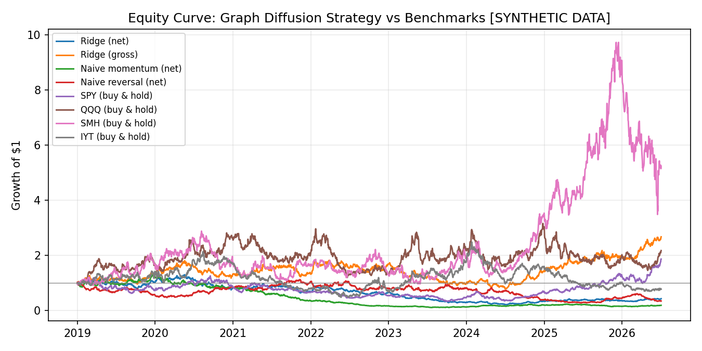
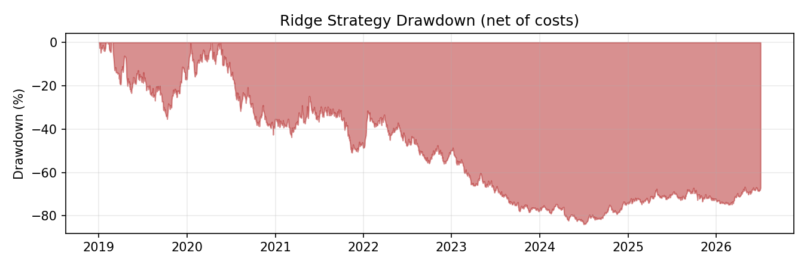
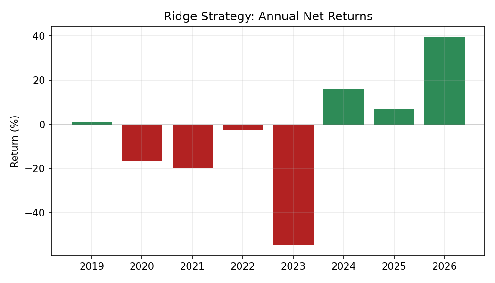
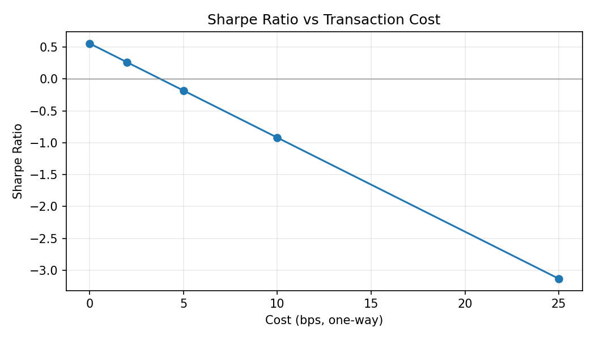
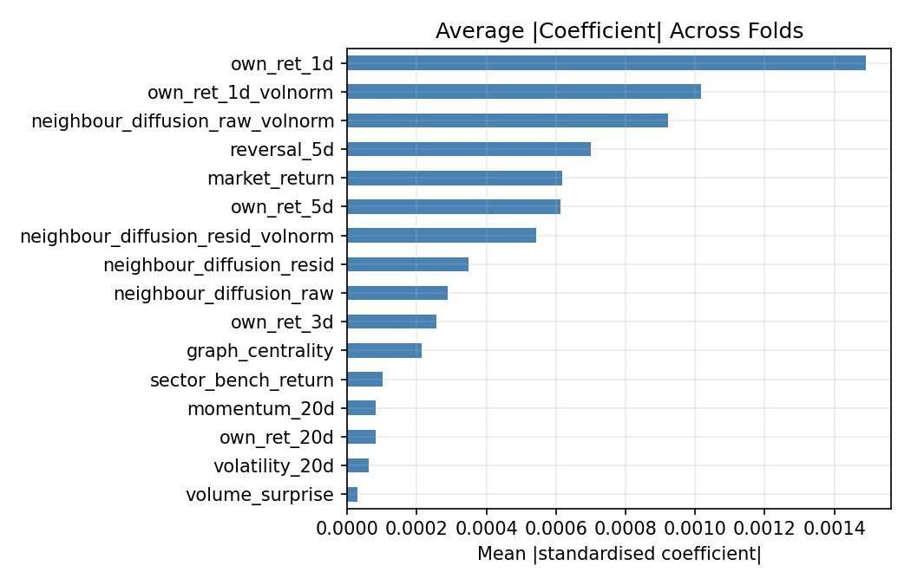
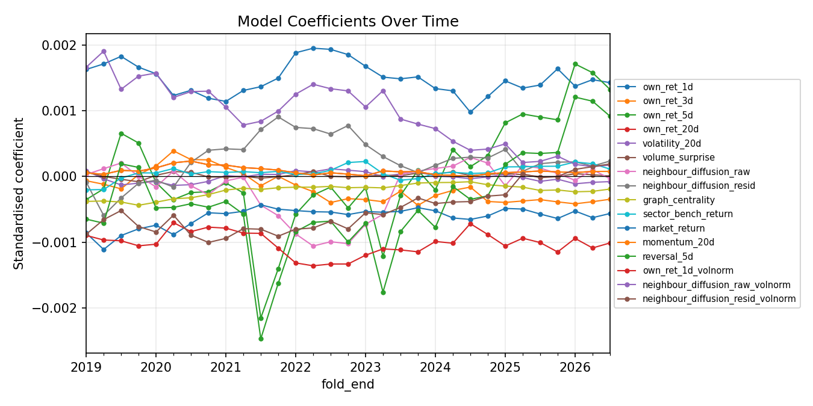
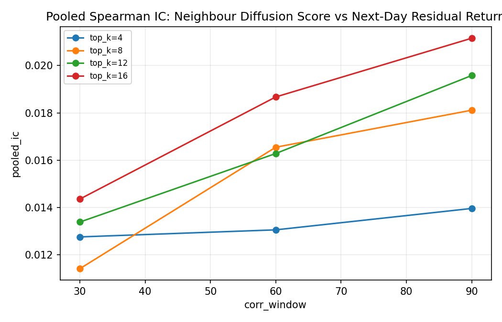

# Cross-Asset Graph Diffusion Signals for Equity Return Prediction

*A walk-forward equity research study across semiconductor, Japanese media/gaming, and transport/logistics equities.*

> **Data notice:** live Yahoo Finance data could not be reached from the environment this build ran in, so the results below were computed on a calibrated **synthetic** OHLCV dataset (see `data/raw/SYNTHETIC_DATA_NOTICE.txt`). The synthetic generator reproduces realistic market/sector correlation structure and volatility clustering but contains **no injected lead-lag or diffusion effect** between names -- it is a placebo dataset. Treat every number in this report as a demonstration that the pipeline runs correctly end-to-end and is leakage-safe, **not** as evidence for or against the underlying hypothesis in real markets. Running `make data` with a working internet connection fetches real data through the identical code path and will produce genuine results.

## 1. Abstract

This project tests whether short-horizon information diffusion across economically connected
equities -- driven by supply-chain, thematic, and investor-flow linkages -- contains exploitable
predictive information for next-day residual equity returns. A rolling correlation graph is built
strictly from past returns, and lagged neighbour return / residual-shock features derived from
that graph are fed into interpretable linear models (Ridge, ElasticNet) inside a walk-forward
backtest with realistic transaction costs. **The numbers quoted below are from a synthetic-data smoke test** (see the data notice above), included to demonstrate the pipeline runs correctly end-to-end and is leakage-safe -- they are not a claim about real markets. The headline out-of-sample net Sharpe ratio for the
Ridge strategy over the synthetic smoke-test test period is **-0.18**,
versus **0.40** for buy-and-hold SPY.
This is a weak/negative result and is reported honestly -- see Sections 9 and the failure-case discussion.

## 2. Hypothesis

Public companies in the same sector, supply chain, or thematic bucket share exposure to common
news shocks (a foundry capacity update, a console sales report, a fuel-price shock), but the market
does not always price that shared exposure into every related name simultaneously. Some names react
immediately; economically linked names may react with a short delay as the market connects the dots,
as arbitrageurs and cross-asset desks slowly transmit the information, or as index/ETF flow effects
spill over. If this delay exists and is even weakly persistent, a stock's own **lagged neighbour
returns** (where "neighbour" is defined by a rolling return-correlation graph, not a static sector
label) should carry information about that stock's **near-future residual return**, after removing
market- and sector-level beta exposure.

This hypothesis is deliberately narrow in scope (semiconductors, Japanese media/gaming/IP, and
transport/logistics -- three groups with plausible supply-chain, thematic, and investor-flow
linkages respectively) rather than a universal claim about all equities.

## 3. Data and Universe

* **Source:** `yfinance` (Yahoo Finance) adjusted daily OHLCV, 2015-01-01 to latest available.
* **Universe:** 29 configured tickers across three sectors (semiconductors/tech,
  Japanese media/gaming/IP, transport/logistics) plus benchmarks SPY, QQQ, SMH, IYT.
  See `config/universe.yaml` for the exact list.
* **Cleaning:** tickers with fewer than 500 trading days of history are dropped
  (a data-sufficiency filter, not a survivorship-bias correction -- this project does **not** claim
  to be survivorship-bias-free; see Section 9). Trading calendars are aligned across the surviving
  universe; short (<=3 day) gaps are forward-filled, longer gaps are dropped.
* **Returns:** simple daily returns from adjusted close. Residual returns are computed via a rolling
  beta regression (window=60 days, method="sector")
  re-estimated **using only data through t-1** at every date, so the beta applied at date t never saw
  date t's own return.

## 4. Feature Construction

All features are computed as of the close of a "feature date" `f` and are only ever paired with a
target return realised strictly after `f` (see `src/graph_diffusion_signal/features.py` module
docstring for the exact timing convention). The rolling correlation graph (window=
60 days, top-k=8, min |corr|=
0.15) is built from returns up to `f-1` only, keeps each node's strongest
positive-correlation neighbours, and is row-normalised. Feature families:

* Own lagged returns (1d, 3d, 5d, 20d)
* Rolling realised volatility (20d) and volume surprise (z-score vs
  20d rolling mean/std)
* Neighbour return diffusion score and neighbour residual-shock diffusion score (graph-weighted
  sums of neighbours' same-day returns/residuals)
* Graph weighted-degree centrality
* Sector benchmark return and broad market return
* Momentum (20d) and short-term reversal (5d)
* Volatility-normalised versions of the return and diffusion features

## 5. Walk-Forward Backtest Design

* Initial training window: 3 years, expanding thereafter.
* Refit frequency: Q (monthly="M", quarterly="Q").
* First eligible test date: 2019-01-01.
* At every refit boundary the model (StandardScaler + Ridge/ElasticNet, hyperparameters chosen by
  time-series cross-validation **inside the training window only**) is retrained from scratch on
  strictly past data and then used to predict every date up to the next refit boundary -- fully
  out-of-sample relative to that fold's training set.
* `tests/test_backtest_no_lookahead.py` verifies this directly, including a test that perturbs
  returns after a cutoff date by a large amount and checks that predictions dated on or before the
  cutoff are bit-for-bit unchanged.

## 6. Transaction Cost Model

Costs are charged as `cost_bps / 10,000 * sum(|weight change|)` at each rebalance, i.e. proportional
to gross traded notional. Default: 5 bps one-way. Sensitivity is reported
at 0, 2, 5, 10, 25 bps.

## 7. Synthetic-Data Smoke-Test Result (Not a Research Finding)

*This section exists to prove the pipeline runs correctly end-to-end and is leakage-safe on realistic-looking input. It is a placebo dataset with no injected lead-lag effect, so it is deliberately **not** presented as a finding about real markets -- re-run `make data` with internet access and rebuild this report to replace this section with a genuine result.*

| Strategy | Net Ann. Return | Net Ann. Vol | Net Sharpe | Net Max DD | Gross Sharpe | Avg Turnover |
| --- | --- | --- | --- | --- | --- | --- |
| Ridge (graph diffusion features) | -0.1037 | 0.3196 | -0.1825 | -0.8390 | 0.5551 | 1.8714 |
| ElasticNet (graph diffusion features) | -0.1893 | 0.3266 | -0.4785 | -0.9281 | 0.3203 | 2.0710 |
| Rank on diffusion score (no fitting) | -0.2118 | 0.3136 | -0.6014 | -0.9459 | 0.3755 | 2.4317 |
| Naive momentum baseline | -0.1936 | 0.3155 | -0.5238 | -0.9168 | -0.2844 | 0.5995 |
| Naive reversal baseline | -0.1282 | 0.3299 | -0.2510 | -0.7542 | 0.1768 | 1.1202 |
| SPY (buy & hold) | 0.0833 | 0.3921 | 0.4005 | -0.7345 | 0.4005 | n/a |
| QQQ (buy & hold) | 0.1049 | 0.4609 | 0.4463 | -0.5961 | 0.4463 | n/a |
| SMH (buy & hold) | 0.2373 | 0.6039 | 0.6514 | -0.6649 | 0.6514 | n/a |
| IYT (buy & hold) | -0.0328 | 0.4901 | 0.1756 | -0.7792 | 0.1756 | n/a |

### Annual Returns (Ridge, net of costs)

| Year | Return | Volatility | Sharpe | Max Drawdown | N Days |
| --- | --- | --- | --- | --- | --- |
| 2019 | 0.0127 | 0.3144 | 0.1963 | -0.3531 | 260 |
| 2020 | -0.1675 | 0.3070 | -0.4434 | -0.4256 | 262 |
| 2021 | -0.1974 | 0.3322 | -0.4965 | -0.3461 | 261 |
| 2022 | -0.0241 | 0.2955 | 0.0645 | -0.3578 | 260 |
| 2023 | -0.5466 | 0.3352 | -2.1889 | -0.5778 | 260 |
| 2024 | 0.1597 | 0.3430 | 0.6041 | -0.3660 | 262 |
| 2025 | 0.0673 | 0.3322 | 0.3616 | -0.1918 | 261 |
| 2026 | 0.3956 | 0.2652 | 1.3886 | -0.1048 | 132 |

### Transaction Cost Sensitivity (Ridge)

| cost_bps | sharpe | ann_return |
| --- | --- | --- |
| 0 | 0.555 | 0.135 |
| 2 | 0.260 | 0.033 |
| 5 | -0.182 | -0.104 |
| 10 | -0.920 | -0.292 |
| 25 | -3.131 | -0.652 |

### Feature Importance (Ridge, standardised coefficients)

## 8. Benchmark Comparison

| Series | Ann. Return | Ann. Vol | Sharpe | Beta to SPY | Alpha (ann.) | Information Ratio |
| --- | --- | --- | --- | --- | --- | --- |
| Ridge strategy (net) | -0.1037 | 0.3196 | -0.1825 | -0.0302 | -0.0522 | -0.4182 |
| SPY | 0.0833 | 0.3921 | 0.4005 | n/a | n/a | n/a |
| QQQ | 0.1049 | 0.4609 | 0.4463 | n/a | n/a | n/a |
| SMH | 0.2373 | 0.6039 | 0.6514 | n/a | n/a | n/a |
| IYT | -0.0328 | 0.4901 | 0.1756 | n/a | n/a | n/a |

Naive rule-based baselines (momentum on the same universe, short-term reversal on the same universe)
are included in the headline table in Section 7 for context -- the graph diffusion features are
compared against both passive benchmarks and simple systematic alternatives, not only against cash.

## 9. Robustness and Failure Cases

**Permutation test** (predictions vs. realised next-day residual return, 56782
observations, 200 permutations): observed Spearman IC =
0.0060, p-value = 0.1542.
This does not clear conventional significance thresholds, i.e. the observed rank relationship between predictions and forward returns is statistically indistinguishable from a random reshuffling.

**Bootstrap Sharpe ratio (90% CI, 1000
resamples):** point estimate -0.18, CI [-0.76, 0.40].
The interval straddles zero, so we cannot reject the possibility that the true out-of-sample Sharpe ratio is zero or negative.

**Parameter sensitivity (graph window x top-k, pooled IC):**

|  | pooled_ic | n_obs |
| --- | --- | --- |
| (30, 4) | 0.0128 | 85985 |
| (30, 8) | 0.0114 | 85985 |
| (30, 12) | 0.0134 | 85985 |
| (30, 16) | 0.0144 | 85985 |
| (60, 4) | 0.0131 | 85376 |
| (60, 8) | 0.0165 | 85376 |
| (60, 12) | 0.0163 | 85376 |
| (60, 16) | 0.0187 | 85376 |
| (90, 4) | 0.0140 | 84506 |
| (90, 8) | 0.0181 | 84506 |
| (90, 12) | 0.0196 | 84506 |
| (90, 16) | 0.0212 | 84506 |

**Known limitations and failure modes:**

* **Transaction costs matter a lot at this turnover.** Compare gross vs net Sharpe in Section 7 --
  average daily turnover of 1.87
  means even the default 5 bps assumption materially erodes returns, and
  the cost-sensitivity table shows the strategy's Sharpe ratio as costs rise toward realistic
  small-cap/short-borrow levels.
* **Regime instability.** The annual returns table shows the strategy's performance is not uniform
  across years; a graph-diffusion effect estimated on one volatility/correlation regime need not
  persist into another (e.g. correlations spike and diversify away in market-wide sell-offs, exactly
  when a diffusion signal might otherwise be most useful).
* **Data-snooping risk.** Feature and hyperparameter choices (graph window, top-k, lag windows) were
  set from domain reasoning and a single sensitivity sweep, not from an independent validation
  universe -- results should be treated as a research prototype, not a validated alpha.
* **Small universe.** 29 names across three sectors is not enough to diversify
  idiosyncratic risk in a long/short book with a 20%/
  20% quantile split; single-name moves can dominate.
* **Survivorship bias is not corrected.** The universe is today's list of liquid names in these
  sectors, not a point-in-time constituent list; any name that was delisted or became illiquid
  earlier in the sample is absent by construction.
* **Liquidity/shorting assumptions are simplified.** The backtest assumes shorting is always
  available at the assumed cost with no borrow fee, no market impact beyond the flat bps cost, and
  full fills at the close -- unrealistic for smaller-cap names in the universe (e.g. RBLX, BILI).
* **Institutional deployment would need:** point-in-time fundamentals and index membership, a
  proper borrow/locate feed, intraday execution data to model market impact and slippage more
  realistically, a much larger and more carefully constructed universe, and out-of-sample validation
  on data the researcher did not already see.

## 10. Conclusion

The graph diffusion signal, as implemented here, does not produce a convincing, cost-robust edge over the test period on this universe -- gross performance is thin and net performance is further eroded by transaction costs, and the permutation/bootstrap tests do not provide strong statistical support.
This is reported as a genuine research finding rather than reframed as a success: a rigorously
built, leakage-safe pipeline that finds a weak or inconclusive signal is a more useful (and more
honest) outcome than an inflated backtest. The engineering value of the project -- leakage-safe
feature construction, walk-forward validation, transaction-cost-aware evaluation, and statistical
robustness testing -- stands independently of whether this particular signal turns out to be
profitable on this particular universe and period.
